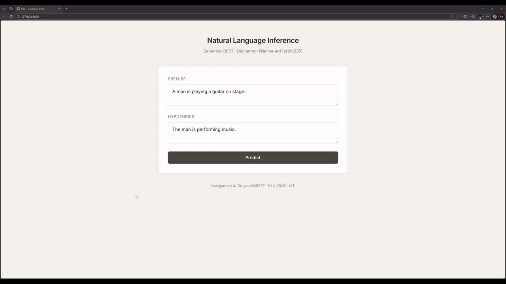

# A4: Do You AGREE?

**NLU Assignment 4** — BERT & Sentence-BERT for Natural Language Inference  
**Student**: Dechathon Niamsa-ard [st126235]

---

## Overview

This project implements **BERT** (Bidirectional Encoder Representations from Transformers) from scratch and extends it into **Sentence-BERT (S-BERT)** with a Siamese network structure for Natural Language Inference (NLI). The BERT model is pre-trained on WikiText-103 using Masked Language Modeling (MLM) and Next Sentence Prediction (NSP), then fine-tuned on the SNLI dataset using the Classification Objective Function (Softmax Loss). A Flask web application provides an interactive interface for real-time NLI prediction.

---

## Project Structure

```
├── app/                              # Flask web application
│   ├── app.py                       # Flask server + model loading + NLI prediction API
│   ├── utils.py                     # Model definitions, tokenization, prediction logic
│   ├── templates/
│   │   └── index.html               # NLI prediction interface (single-page app)
│   └── static/
│       ├── css/
│       │   └── style.css            # Loft / minimal aesthetic styling
│       └── js/
│           └── main.js              # Client-side form handling & result display
├── assets/                           # Saved visualizations & diagrams
│   ├── SBERT.png                    # Sentence-BERT architecture diagram
│   ├── pipeline.png                 # Prediction pipeline diagram
│   └── app-demo.gif                 # Web app demonstration
├── lab_04/                           # Lab reference notebooks
│   ├── BERT.ipynb
│   ├── BERT-update.ipynb
│   └── S-BERT.ipynb
├── model/                            # Saved model artifacts
│   ├── bert_pretrained.pth          # Pre-trained BERT weights + hyperparameters
│   ├── sbert_nli.pth               # Fine-tuned S-BERT weights (BERT + classifier)
│   └── vocab.pkl                    # Custom vocabulary (word2id / id2word mappings)
├── st126235_assignment_4.ipynb       # Main notebook (Tasks 1–4)
├── pyproject.toml                    # Project config & dependencies
└── README.md                         # This file
```

---

## Quick Start

```bash
# Setup environment
uv venv && uv sync
# Or: pip install torch flask scikit-learn datasets transformers tqdm matplotlib numpy

# Train models (run notebook cells)
jupyter notebook st126235_assignment_4.ipynb

# Run web app
cd app && python app.py
```

Open http://localhost:5000 in your browser.

---

## Task 1: Training BERT from Scratch (2 points)

**Objective**: Implement BERT from scratch following the concepts learned in class, train it on a suitable dataset, and save the model weights for use in Task 2.

### Dataset: WikiText-103

- **Source**: [Salesforce/wikitext](https://huggingface.co/datasets/Salesforce/wikitext) (WikiText-103-raw-v1)
- Loaded first 300,000 samples, filtered entries with ≤50 characters
- **Final dataset size**: 132,183 samples

**Citation**:
```bibtex
@misc{merity2016pointer,
      title={Pointer Sentinel Mixture Models},
      author={Stephen Merity and Caiming Xiong and James Bradbury and Richard Socher},
      year={2016},
      eprint={1609.07843},
      archivePrefix={arXiv},
      primaryClass={cs.CL}
}
```

### Vocabulary

Built from the preprocessed WikiText data with word-level tokenization:

| Token | Index | Purpose |
|-------|-------|---------|
| `[PAD]` | 0 | Padding token |
| `[CLS]` | 1 | Classification token |
| `[SEP]` | 2 | Separator token |
| `[MASK]` | 3 | Mask token for MLM |

- **Vocabulary size**: 199,405 tokens

### BERT Model Architecture

The model follows the original BERT architecture with two pre-training objectives: **Masked Language Modeling (MLM)** and **Next Sentence Prediction (NSP)**.

| Component | Configuration |
|-----------|---------------|
| Encoder Layers | 6 |
| Attention Heads | 8 |
| Hidden Size (d_model) | 768 |
| Feed-Forward Size (d_ff) | 3,072 (4 × d_model) |
| Head Dimension (d_k = d_v) | 64 |
| Max Sequence Length | 512 |
| Positional Encoding | Learned embeddings |
| Weight Tying | Decoder shares token embedding weights |
| Total Parameters | 192,717,807 |

### Pre-training Configuration

| Setting | Value |
|---------|-------|
| Epochs | 100 |
| Batch Size | 6 |
| Learning Rate | 0.0001 (Adam) |
| Loss Function | Cross-Entropy (MLM + NSP) |
| Masking Strategy | 15% tokens: 80% [MASK], 10% random, 10% unchanged |
| Max Masked Tokens | 5 per sequence |

---

## Task 2: Sentence Embedding with Sentence-BERT (3 points)

**Objective**: Implement the pre-trained BERT from Task 1 with a Siamese network structure to derive semantically meaningful sentence embeddings, trained using the Classification Objective Function (Softmax Loss).

$$o = \text{softmax}\left(W^T \cdot (u, v, |u - v|)\right)$$

### NLI Dataset: SNLI (Stanford Natural Language Inference)

- **Source**: [stanfordnlp/snli](https://huggingface.co/datasets/stanfordnlp/snli)
- Labels: `0 = entailment`, `1 = neutral`, `2 = contradiction`
- Filtered out samples with label `-1` (no annotator agreement)

| Split | Original Size | Filtered Size | Used Subset |
|-------|:---:|:---:|:---:|
| Train | 550,152 | 549,367 | 50,000 |
| Validation | 10,000 | 9,842 | 9,842 |
| Test | 10,000 | 9,824 | 9,824 |

**Citation**:
```bibtex
@inproceedings{bowman-etal-2015-large,
    title = "A large annotated corpus for learning natural language inference",
    author = "Bowman, Samuel R. and Angeli, Gabor and Potts, Christopher and Manning, Christopher D.",
    booktitle = "Proceedings of the 2015 Conference on Empirical Methods in Natural Language Processing",
    year = "2015",
    publisher = "Association for Computational Linguistics",
    url = "https://aclanthology.org/D15-1075",
    pages = "632--642",
}
```

### Sentence-BERT Architecture

| Component | Detail |
|-----------|--------|
| **BERT Backbone** | Same as Task 1 (6 layers, 8 heads, d_model=768) |
| **Pooling Strategy** | Mean pooling over token embeddings (excluding padding) |
| **Classifier Input** | Concatenation of [u; v; \|u−v\|] → dimension = 3 × 768 = 2,304 |
| **Classifier Output** | 3 classes (entailment, neutral, contradiction) |
| **Total Parameters** | 192,724,722 (BERT: 192,717,807 + Classifier: 6,915) |

### S-BERT Training Configuration

| Setting | Value |
|---------|-------|
| Epochs | 5 |
| Batch Size | 32 |
| Learning Rate | 2e-5 (Adam) |
| Scheduler | Linear warmup (10%) + linear decay |
| Total Training Steps | 7,815 |
| Warmup Steps | 781 |
| Loss Function | CrossEntropyLoss (Softmax Loss) |

### Training Progress

| Epoch | Avg Loss | Train Accuracy |
|:---:|:---:|:---:|
| 1 | 1.0245 | 45.83% |
| 2 | 0.8890 | 58.38% |
| 3 | 0.8265 | 62.61% |
| 4 | 0.7795 | 65.59% |
| 5 | 0.7336 | 68.20% |

---

## Task 3: Evaluation and Analysis (1 point)

**Objective**: Provide performance metrics (Classification Report) based on the SNLI dataset for the NLI task, and discuss limitations and potential improvements.

### Classification Report (Test Set)

| | precision | recall | f1-score | support |
|---|:---:|:---:|:---:|:---:|
| **entailment** | 0.63 | 0.70 | 0.66 | 3,368 |
| **neutral** | 0.62 | 0.59 | 0.61 | 3,219 |
| **contradiction** | 0.63 | 0.59 | 0.61 | 3,237 |
| **accuracy** | | | **0.63** | 9,824 |
| **macro avg** | 0.63 | 0.63 | 0.63 | 9,824 |
| **weighted avg** | 0.63 | 0.63 | 0.63 | 9,824 |

> **Overall Test Accuracy**: 62.87%

### Analysis

- **Entailment** has the highest recall (0.70), meaning the model is best at identifying when a hypothesis logically follows from the premise.
- **Neutral** and **contradiction** have lower recall (~0.59), indicating these are harder relationships to distinguish.
- The balanced precision across all classes (~0.63) shows the model does not strongly favor any single class.

### Limitations & Potential Improvements

1. **Custom word-level vocabulary** — OOV words mapped to `[MASK]` cause information loss. Using a BPE/WordPiece tokenizer would handle rare words through subword decomposition.
2. **Limited pre-training** — Only ~132K samples for 100 epochs with batch size 6. The original BERT used billions of words.
3. **Reduced architecture** — 6 layers vs. BERT-base's 12 layers limits capacity for complex linguistic patterns.
4. **Subset training** — Only 50K of ~550K SNLI training samples used. Full dataset would improve generalization.
5. **Potential improvements**: Use pre-trained tokenizer, increase pre-training data/epochs, combine SNLI + MNLI, apply data augmentation, experiment with pooling strategies.

---

## Task 4: NLI Web Application (1 point)

**Objective**: Develop a web application that demonstrates the NLI capabilities of the trained Sentence-BERT model with two input boxes for premise and hypothesis.



### Features

- **Flask web app** with clean, loft / minimal aesthetic UI
- **Two text inputs** — Enter premise and hypothesis sentences
- **NLI prediction** — Color-coded label (green = entailment, amber = neutral, red = contradiction)
- **Confidence score** — Softmax probability of predicted class
- **Cosine similarity** — Semantic relatedness between sentence embeddings

### System Architecture

```
┌──────────────────┐       POST /predict         ┌──────────────────┐
│                  │  ─────────────────────────>  │                  │
│   Browser (UI)   │  { premise, hypothesis }     │   Flask Server   │
│   index.html     │                              │    app.py        │
│                  │  <─────────────────────────  │                  │
└──────────────────┘  { label, confidence, sim }  └────────┬─────────┘
                                                           │
                                                  ┌────────▼─────────┐
                                                  │   S-BERT Model   │
                                                  │  (BERT + Head)   │
                                                  │                  │
                                                  │  sbert_nli.pth   │
                                                  │  vocab.pkl       │
                                                  └──────────────────┘
```

### How the Web App Interfaces with the Model

#### 1. Model Loading (Server Startup)

When the Flask server starts, `load_model()` performs a one-time initialization:
1. Loads custom vocabulary (`vocab.pkl`) with `word2id` dictionary
2. Loads checkpoint (`sbert_nli.pth`) with BERT backbone + classifier head weights
3. Reconstructs `BERT` model and `Linear` classifier using saved hyperparameters
4. Sets both models to evaluation mode (`.eval()`)

#### 2. Prediction Pipeline

| Step | Component | Description |
|------|-----------|-------------|
| 1 | Text preprocessing | Lowercase, remove punctuation |
| 2 | Tokenization | Convert words to IDs via custom vocabulary |
| 3 | Special tokens | Wrap with `[CLS]` and `[SEP]`, pad to 128 |
| 4 | BERT encoding | Pass premise & hypothesis through shared BERT encoder |
| 5 | Mean pooling | Aggregate token embeddings into sentence vectors u, v |
| 6 | Classification | Concatenate [u; v; \|u−v\|] → Linear → Softmax |
| 7 | Similarity | Compute cosine similarity between u and v |

#### 3. API Endpoints

| Endpoint | Method | Description | Request Body | Response |
|----------|--------|-------------|--------------|----------|
| `/` | GET | Serves the main NLI interface | — | HTML page |
| `/predict` | POST | Predicts NLI relationship | `{"premise": str, "hypothesis": str}` | `{"label": str, "confidence": float, "similarity": float, "color": str}` |

### Running the App

```bash
cd app
python app.py
# Open http://localhost:5000
```

---

## Dataset Sources

| Dataset | Description | Source |
|---------|-------------|--------|
| WikiText-103 | Large-scale language modeling corpus (pre-training) | [Salesforce/wikitext](https://huggingface.co/datasets/Salesforce/wikitext) |
| SNLI | Stanford Natural Language Inference (fine-tuning) | [stanfordnlp/snli](https://huggingface.co/datasets/stanfordnlp/snli) |

---

## Technical Notes

- **Custom Vocabulary**: Word-level vocabulary built from WikiText-103 (199,405 tokens). OOV words are mapped to `[MASK]` token.
- **GPU Support**: Trained on NVIDIA GPU with PyTorch 2.9+ and CUDA 13.0.
- **Weight Tying**: The MLM decoder shares weights with the token embedding layer, reducing parameters and improving training.
- **Self-Contained Web App**: All model classes are replicated inside `utils.py` so the web app does not import from the notebook.
- **Siamese Architecture**: Both premise and hypothesis are encoded through the **same** BERT instance (shared weights), which is the defining feature of Sentence-BERT.

---

## References

- Devlin, J., et al. (2019). *"BERT: Pre-training of Deep Bidirectional Transformers for Language Understanding."* — [ACL Anthology](https://aclanthology.org/N19-1423.pdf)
- Reimers, N. & Gurevych, I. (2019). *"Sentence-BERT: Sentence Embeddings using Siamese BERT-Networks."* — [ACL Anthology](https://aclanthology.org/D19-1410/)
- Bowman, S. R., et al. (2015). *"A large annotated corpus for learning natural language inference."* — [ACL Anthology](https://aclanthology.org/D15-1075/)
- Vaswani, A., et al. (2017). *"Attention Is All You Need."* — [arXiv:1706.03762](https://arxiv.org/abs/1706.03762)
- WikiText-103 — [Hugging Face](https://huggingface.co/datasets/Salesforce/wikitext)
- SNLI Dataset — [Hugging Face](https://huggingface.co/datasets/stanfordnlp/snli)

---

## Requirements

- Python 3.11+
- PyTorch 2.9+
- Flask 3.1+
- scikit-learn 1.7+
- HuggingFace Datasets 4.5+
- HuggingFace Transformers 5.1+
- NumPy 2.3+
- Matplotlib 3.10+
- tqdm 4.67+

See `pyproject.toml` for full dependencies.

---
